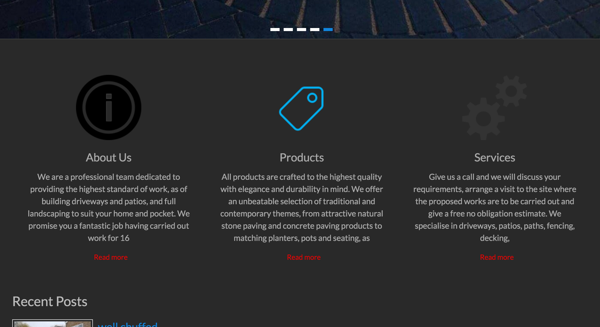
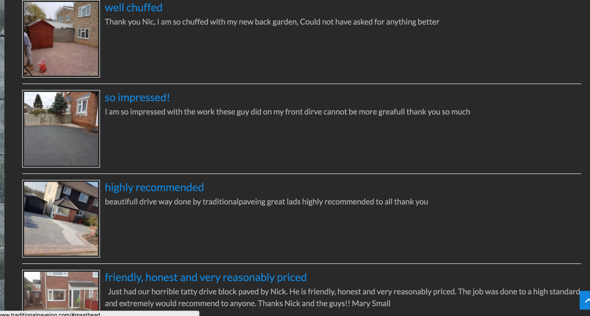
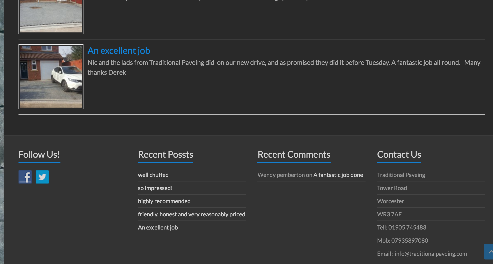
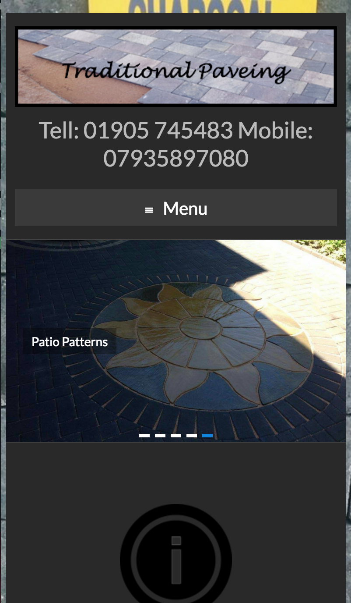

#instructions

to run this project

```
git clone git@github.com:jrose111284/traditionalpaveing.git
open public/index.html
```
This project is for me to copy a web page and play about with html and css.


#info

this is a web site i built for a friend a while back with word press, Im going to make the home page with just html and css no boot strap. It will also pull in so can work on a phone

Heres the web site in word press web browser format






Mobile phone format

